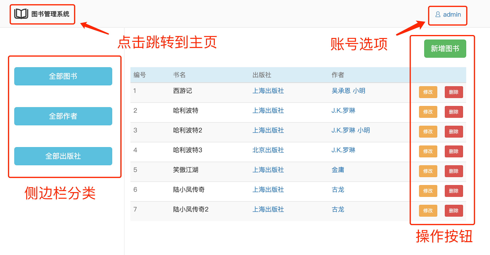
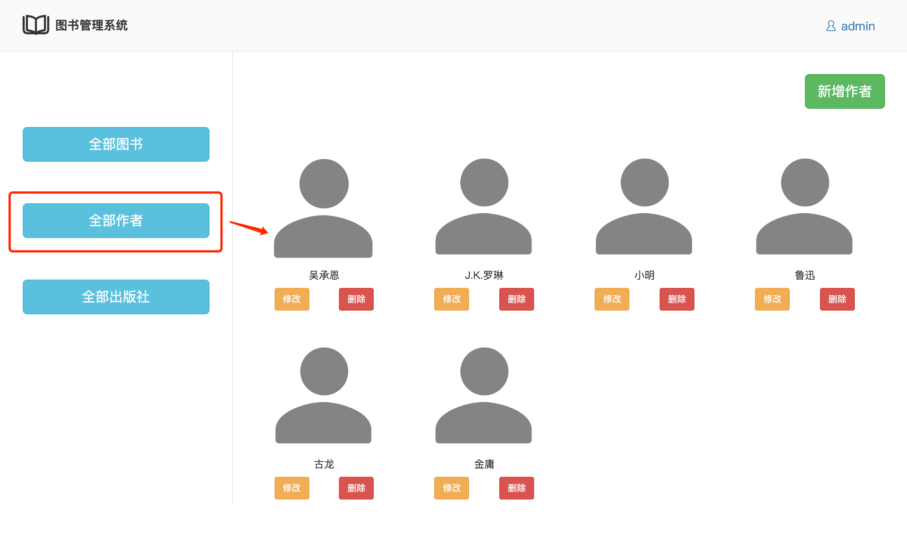

## 图书管理系统

### 1.[功能描述]
1. 允许用户注册、登录
2. 系统按图书、作者、出版社进行分类
    * 点击全部图书：列出所有图书
    * 点击全部作者：列出所有作者
    * 点击全部出版社：列出所有出版社
3. 作者、出版社支持超链接跳转
    * 点击作者：列出该作者的所有图书
    * 点击出版社：列出该出版社下所有图书
4. 可以对图书、作者、出版社进行增加、修改、删除操作
    * 要求书名不可重复，且不可修改

### 2.[开发环境]
1. 操作系统：macOS10.15.7
2. 解释器版本：python3.7
3. web框架：Django3.1.1

### 3.[项目结构简介]
1. app_auth（注册、认证功能）
    * auth_forms.py
        > 初始化注册、登录相关的校验规则类
    * urls.py
    * views.py
        > 注册、登录相关的视图函数
2. app_home（主页逻辑功能）
    * home_forms.py
        > 初始化编辑、修改相关的校验规则类
    * models.py
        > 初始化数据表：书籍、作者、出版社、关系表
    * urls.py
    * views.py
        > 主页相关的视图函数
3. book
    * setting.py
        > 配置文件
    * urls.py
        > 路由分发
4. static（本地静态文件）
    * auth
        > 认证相关的网页引用的所有文件
    * home
        > 主页相关的网页引用的所有文件
    * bootstrap-3.3.7
    * fonts
    * jquery-3.1.1.min.js
    * reset.css
5. templates
    * auth
        > 用户认证相关的所有html文件
    * home
        > 系统主页相关的所有html文件
    * base.html
        > 通用html，被继承
    * base2.html
        > 通用html，被继承
6. db.sqlite3
7. manage.py

### 4.[启动方式]
1. 开启mysql数据库
    * 创建一个新库以存放表
    ```mysql
    create database db_book;
    ```
    * 修改对应setting.py数据库连接配置
    ```python
    DATABASES = {
        'default': {
            'ENGINE': 'django.db.backends.mysql',
            'NAME': 'db_book',  # 数据库名
            'USER': '****',  # mysql账号
            'PASSWORD': '******',  # mysql密码
            'HOST': '127.0.0.1',
            'PORT': 3306
        }
    }
    ```
2. 终端运行以下指令，生成表结构
```
python3 manage.py makemigrations
python3 manage.py migrate
```
3. 启动方式一：终端
```
python3 manage.py runserver 127.0.0.1:8080
```
4. 启动方式二：IDE
    * pycharm直接运行
5. 浏览器输入对应IP
    * http://127.0.0.1:8080/
### 5.[用户登录信息]
1. 默认账号、密码
    * 账号：admin
    * 密码：123456
2. 可自行注册新的管理员账号密码
### 6.[运行效果]
1. 登录页面

2. 注册页面


3. 主页




4. 增加、修改及删除


